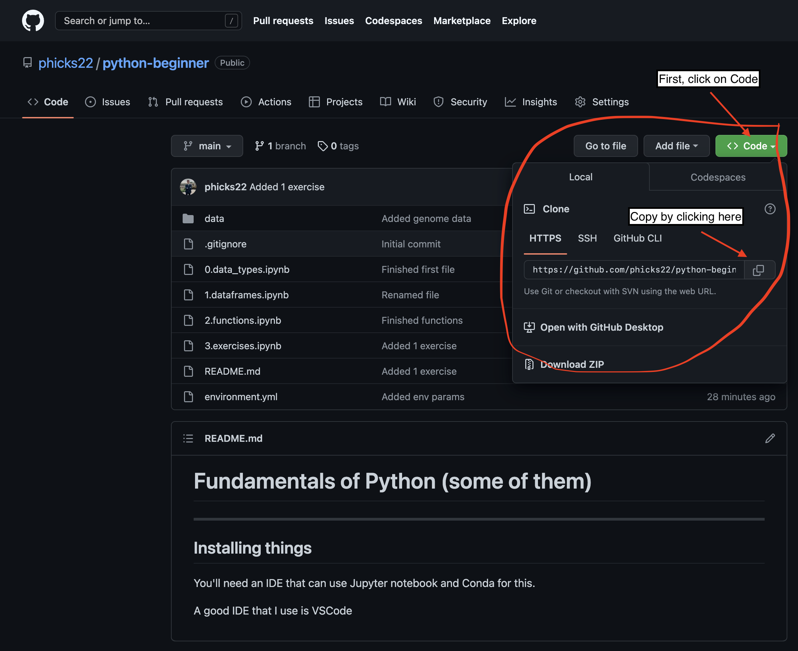
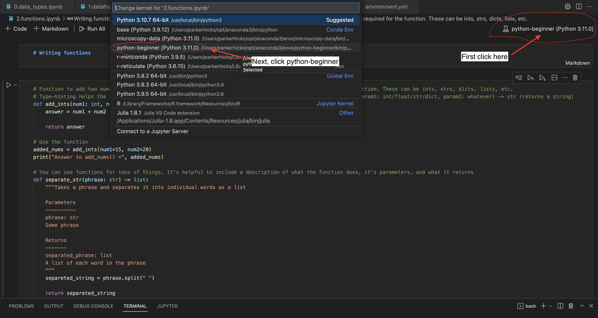

# Fundamentals of Python (some of them)
---
## Installing things
You'll need an IDE that can use Jupyter notebook and Conda for this.

#### IDE
A good IDE that I use is VSCode. Follow the instructions [here](https://code.visualstudio.com/download) to download.

#### Conda
Conda is a package manager that allows you to create virtual environments that contain modules that you need to use for a specific repository. This prevents dependency errors and conflicting package versions.

To install conda, go [here](https://www.anaconda.com/products/distribution) and follow the instructions.

---
## Download my repository
Open your terminal and move to the directory where you want this repository to live.

Example:
```bash
cd Documents/some_folder
```

Next, copy the repository address from my repository.



Run the following in the terminal (git clone + what you copied):
```bash
git clone https://github.com/phicks22/python-beginner.git
```

You now have a copy of my repository on your local machine.

To open the code in VSCode do the following:
* File
* Open Folder
* Open python-beginner

---
## Activating the Conda environment
Make sure you're in the main directory of the repository (`'path/to/python-beginner'`).

Next, run this in the terminal:
```bash
conda env create -n python-beginner
```

This will generate a virtual environment (venv) with all necessary packages for this repository. Now we have to activate it:
```bash
conda activate python-beginner
```

Your venv should be good to go.

**Note:** Make sure that VSCode is using your venv as the kernel for the Jupyter files.

Follow these instructions:


---
## Complete the modules
In order from `0.data_types.ipynb` to `4.exercises.ipynb`